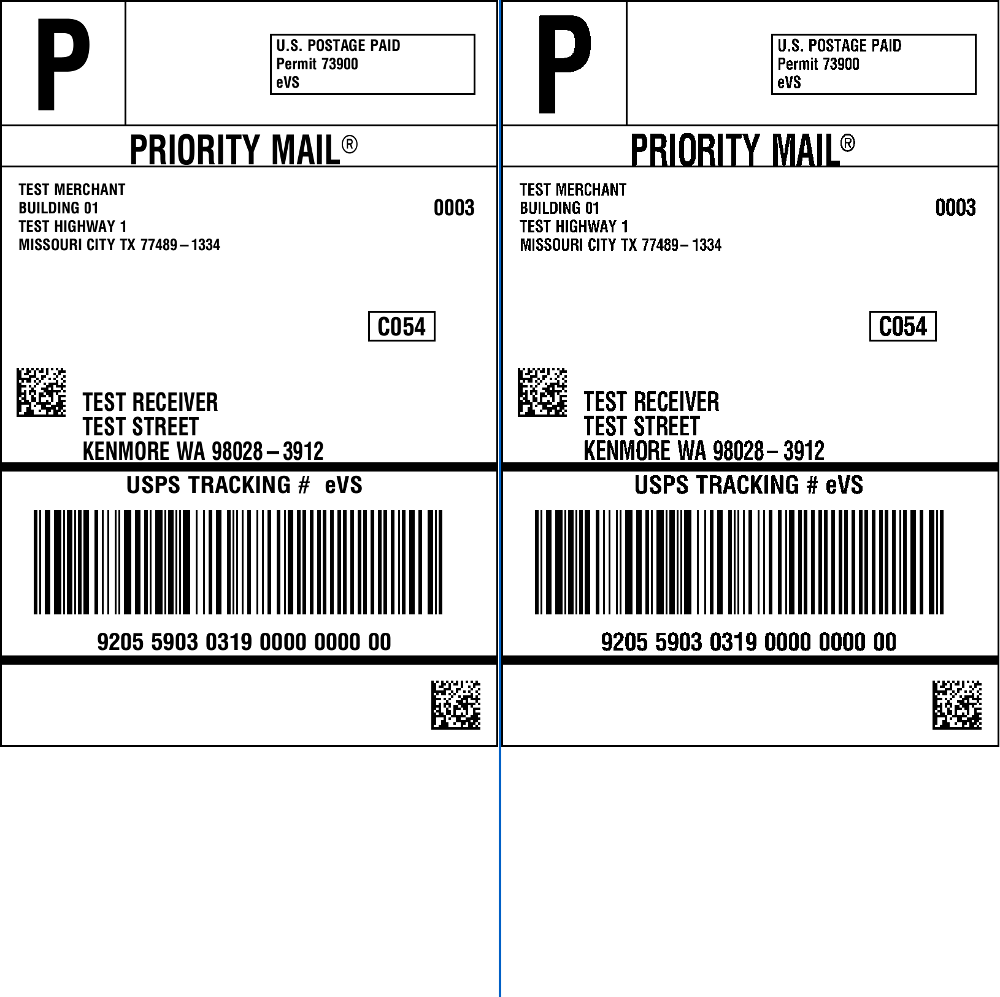

# Labelize — ZPL / EPL Label Renderer

[](https://crates.io/crates/labelize)
[](https://www.npmjs.com/package/@goodboy008/labelize-wasm)
[](LICENSE)
[](https://github.com/GOODBOY008/labelize/actions)
[](https://github.com/GOODBOY008/labelize/actions/workflows/docker.yml)

> **Turn ZPL/EPL into pixels — label rendering, simplified.**

Labelize is a fast, open-source Rust engine that parses **ZPL** (Zebra Programming Language) and **EPL** (Eltron Programming Language) label data and renders it to **PNG** or **PDF**. Use it as a **CLI tool**, an **HTTP microservice**, a **Rust library**, or a **WebAssembly package** for JavaScript/TypeScript projects — no printer hardware required.

**Try it online** — a free public playground runs on Cloudflare Workers: <https://labelize.764629910.workers.dev>. Paste ZPL/EPL, preview the rendered label, and download PNG or PDF, no install needed.

If you need a self-hosted, offline alternative to [Labelary](http://labelary.com/) for previewing and converting thermal label formats, Labelize has you covered.

Existing solutions either depend on external services (Labelary API — data privacy concerns), require paid licenses (often hundreds of dollars), or produce poor rendering quality. Labelize gives you a fast, free, open-source option that runs entirely on your own infrastructure.

## Why Labelize?

| | Labelize | Labelary (web) | Zebra Printer |
|---|---|---|---|
| **Offline / self-hosted** | ✅ | ❌ | ✅ |
| **No hardware needed** | ✅ | ✅ | ❌ |
| **Open source** | ✅ | ❌ | ❌ |
| **EPL support** | ✅ | ❌ | ✅ |
| **PDF output** | ✅ | ❌ | ❌ |
| **Embeddable library** | ✅ | ❌ | ❌ |
| **REST API** | ✅ | ✅ | ❌ |
| **Cost** | Free | Free / paid | Hardware cost |

## Performance

Benchmarked against the Labelary API on the same set of labels:

| Metric | Labelize | Labelary API |
|--------|----------|--------------|
| Avg render time | ~5 ms | ~388 ms |
| Offline | ✅ | ❌ |
| Data privacy | Full control | Third-party |

## Features

- **ZPL Parser** — 30+ ZPL commands: text, barcodes, graphics, stored formats, graphic fields, field blocks, and more
- **EPL Parser** — EPL command support for text, barcodes, line draw, and reference points
- **10 Barcode Symbologies** — Code 128, Code 39, EAN-13, Interleaved 2-of-5, PDF417, Aztec, DataMatrix, QR Code, MaxiCode
- **PNG & PDF Output** — Monochrome 1-bit PNG or single-page embedded PDF output
- **CLI Tool** — Convert ZPL/EPL files from the command line with format auto-detection, multi-label support, and customizable label dimensions
- **HTTP Microservice** — RESTful API for label conversion with format detection via `Content-Type` header; deploy anywhere with Docker, bare metal, or Cloudflare Workers
- **Web Playground** — Built-in browser UI at `GET /` — paste or open a `.zpl`/`.epl` file, choose a label size (4×6, 4×4, etc.), render PNG inline, download PNG or PDF with one click, and compare your render side-by-side against the Labelary reference with a diff score. A free public instance is hosted at <https://labelize.764629910.workers.dev>
- **WebAssembly Package** — `@goodboy008/labelize-wasm` renders ZPL/EPL to PNG/PDF directly in browsers, Node.js, and bundlers — no server required
- **Embedded Fonts** — Zero runtime font dependencies; bundles Helvetica Bold Condensed, DejaVu Sans Mono, and ZPL GS fonts
- **Rust Library** — Integrate label rendering directly into your Rust application via the public API

## Quick Start

### Try it online

Open **<https://labelize.764629910.workers.dev>** — a free playground hosted on Cloudflare Workers. Paste ZPL/EPL, preview the rendered label in your browser, and download PNG or PDF. Same engine, same UI as the self-hosted version. Hit **Compare with Labelary** (ZPL only) to fetch the Labelary reference render and get a diff score on the same scale as the CI golden tests.

### Installation

```bash
# Via Homebrew (macOS / Linux)
brew tap GOODBOY008/homebrew-labelize && brew install labelize

# From source (requires Rust toolchain)
cargo install --path . --features cli

# Windows — download from GitHub Releases:
#   1. Go to https://github.com/GOODBOY008/labelize/releases
#   2. Download labelize-x86_64-pc-windows-msvc.zip
#   3. Extract the .exe and add it to your PATH

# Windows — via cargo (requires Rust toolchain):
cargo install labelize --features cli
```

### Use from JavaScript / TypeScript

The engine is compiled to WebAssembly and published as [`@goodboy008/labelize-wasm`](https://www.npmjs.com/package/@goodboy008/labelize-wasm):

```bash
npm install @goodboy008/labelize-wasm
```

**Node.js (≥ 20)** — no bundler or flags needed:

```js
import { lz_render } from "@goodboy008/labelize-wasm/init";

const zpl = Buffer.from("^XA^FO50,50^A0N,40,40^FDHello World^FS^XZ", "ascii");
const png = lz_render(zpl, 102.0, 152.0, 8, false, false, false); // Uint8Array PNG
```

**Bundlers** (webpack 5, Vite with `vite-plugin-wasm`):

```js
import { lz_render } from "@goodboy008/labelize-wasm";
```

`lz_render(src, width_mm, height_mm, dpmm, antialias, want_pdf, is_epl)` returns PNG (or PDF) bytes.
Errors throw `1:`/`2:`-prefixed strings (parse vs. render failure). The same raw glue + wasm files
are attached to every GitHub Release as `labelize-wasm-wasm32.zip`.

### Convert a ZPL label to PNG

```bash
labelize convert label.zpl          # → label.png  (format auto-detected)
labelize convert label.epl          # EPL works too
labelize convert label.zpl -t pdf   # output as PDF
labelize convert label.zpl --width 100 --height 62 --dpmm 12  # custom dimensions
labelize convert label.zpl --antialias  # 8-bit grayscale output (default: 1-bit)
```

### Run as an HTTP microservice

```bash
labelize serve --port 8080
```

Open **http://localhost:8080/** in your browser to use the built-in **interactive playground** — paste ZPL/EPL, pick a label size, and render PNG instantly. Download PNG or PDF directly from the page, or click **Compare with Labelary** to score your render against the Labelary reference image.

```bash
# Convert via REST API
curl -X POST http://localhost:8080/convert \
  -H "Content-Type: application/zpl" \
  -d '^XA^FO50,50^A0N,40,40^FDHello World^FS^XZ' \
  -o label.png
```
### Run as Docker web service

Pre-built multi-arch images (`linux/amd64` + `linux/arm64`) are published on every
release:

```bash
# Docker Hub
docker run -p 8080:8080 goodboy008/labelize:latest

# GitHub Container Registry
docker run -p 8080:8080 ghcr.io/goodboy008/labelize:latest
```

Available tags: `latest` (newest stable release), `1.3.0` / `1.3` / `1` (pinned
versions), and `edge` (current `main`).

Or build and run it from source with Compose:

```bash
docker compose up -d --build
```


## CLI Reference

```
Usage: labelize <COMMAND>

Commands:
  convert  Convert a ZPL/EPL file to PNG or PDF
  serve    Start HTTP server for label conversion

Convert Options:
  <INPUT>               Input file path (.zpl or .epl)
  -o, --output <PATH>   Output file path (default: input stem + .png/.pdf)
  -f, --format <FMT>    Input format override: zpl | epl
  -t, --type <TYPE>     Output type: png | pdf [default: png]
  --width <MM>          Label width in mm [default: 102]
  --height <MM>         Label height in mm [default: 152]
  --dpmm <N>            Dots per mm [default: 8]

Serve Options:
  --host <HOST>         Bind address [default: 0.0.0.0]
  -p, --port <PORT>     Listen port [default: 8080]
```

## HTTP API

| Endpoint       | Method | Description                                   |
|---------------|--------|-----------------------------------------------|
| `/`           | GET    | Interactive web playground (browser UI)       |
| `/health`     | GET    | Health check → `{"status":"ok"}`             |
| `/convert`    | POST   | Convert label data → PNG or PDF              |

**POST /convert** query parameters:

| Parameter | Default | Description            |
|-----------|---------|------------------------|
| `width`   | 102     | Label width in mm      |
| `height`  | 152     | Label height in mm     |
| `dpmm`    | 8       | Dots per mm            |
| `output`  | png     | Output format: png/pdf |
| `antialias` | false | Preserve antialiased greys instead of 1-bit black/white |

Set `Content-Type: application/zpl` or `Content-Type: application/epl` to select the parser.

## Library Usage

```rust
use std::io::Cursor;
use labelize::{ZplParser, Renderer, DrawerOptions};

let zpl = b"^XA^FO50,50^A0N,40,40^FDHello^FS^XZ";
let mut parser = ZplParser::new();
let labels = parser.parse(zpl).unwrap();

let renderer = Renderer::new();
let mut buf = Cursor::new(Vec::new());
renderer.draw_label_as_png(&labels[0], &mut buf, DrawerOptions::default()).unwrap();

std::fs::write("output.png", buf.into_inner()).unwrap();
```

## Supported ZPL & EPL Commands

### ZPL Commands

DataMatrix ECC 200 field-data escapes and firmware defaults are described in
[DataMatrix field data](docs/DATAMATRIX_FIELD_DATA.md).

| Category | Commands |
|----------|----------|
| **Text & Font** | `^FO` `^FT` `^FD` `^FS` `^A` `^A@` (named font) `^CF` `^CW` (font identifier) `^FB` `^FR` `^FH` `^FN` `^FW` `^FV` |
| **Barcodes** | `^BC` (Code 128) `^BE` (EAN-13) `^B8` (EAN-8) `^B9` (UPC-E) `^BU` (UPC-A) `^B2` (Interleaved 2-of-5) `^B3` (Code 39) `^B7` (PDF417) `^BO` (Aztec) `^BX` (DataMatrix) `^BQ` (QR Code) `^BD` (MaxiCode) `^BY` (defaults) |
| **Graphics** | `^GB` (box) `^GC` (circle) `^GD` (diagonal) `^GE` (ellipse) `^GF` (graphic field) `^GS` (symbol) `~DG` (download graphic) `^IL` `^XG` `^ID` `^IM` `^IS` `~EG` |
| **Label Control** | `^XA` `^XZ` `^PW` `^PO` `^LH` `^LR` `^LT` (label top) `^LS` (label shift) `^LL` (label length) `^CI` `^MU` (units of measurement) `^PQ` (print quantity) `^FX` (comment) `^SN`/`^SF` (serial state) |
| **Stored Formats** | `^DF` `^XF` |

DataMatrix rendering supports **ECC 000, 050, 080, 100, 140 and 200**. Omitted or empty ZPL
`^BX` quality defaults to ECC 000, as specified by Zebra; use `^BXN,4,200`
for modern ECC 200. The Legacy path supports six encodation formats,
CRC, convolutional protection, randomization and square symbols up to 49 modules.
Legacy ZPL preserves raw field bytes and `^FH` bytes, including stored-format
recalls. The documented `\&` and `\\` substitutions are supported; the
ambiguous `||` sequence and numeric records above 511 remain explicit errors.
They never silently become ECC 200. The raw Legacy encoder API accepts bytes.
EPL DataMatrix continues to use ECC 200. See [Legacy scope and evidence](docs/DATAMATRIX_LEGACY.md)
for the norm-based implementation, printer observations, limitations and source
attribution. No independent overall validation is claimed.

### EPL Commands

`N` (new label) · `A` (text) · `B` (barcode) · `LO` (line draw) · `R` (reference point) · `P` (print)

## Architecture

```
  ZPL/EPL input
       │
       ▼
  ┌─────────┐     ┌──────────┐     ┌─────────┐
  │  Parser  │ ──▶ │ Renderer │ ──▶ │ Encoder │
  └─────────┘     └──────────┘     └─────────┘
       │                │                │
   LabelInfo        RgbaImage       PNG / PDF
```

- **Parser** — Tokenizes input, maintains VirtualPrinter state, produces `Vec<LabelElement>`
- **Renderer** — Creates canvas, iterates elements, dispatches drawing (text, graphics, barcodes), handles reverse print and label inversion
- **Encoder** — Converts RGBA image to monochrome PNG or embeds into single-page PDF

## Render Comparison

Side-by-side comparison against [Labelary](http://labelary.com/) reference renderer. Left = Labelary, Right = Labelize.

All diff images are in [`testdata/diffs/`](testdata/diffs/) — browse them to review any label.

| Label | Diff | Preview |
|-------|------|---------|
| amazon | 2.26% |  |
| fedex | 5.77% |  |
| ups | 5.74% |  |
| dhlpaket | 2.17% |  |
| usps | 4.05% |  |
| swisspost | 1.49% |  |

**83 labels tested** — 6 perfect · 27 good (<1%) · 39 minor (<5%) · 11 moderate (<15%) · 0 high

> Full report: [`testdata/diffs/diff_report.txt`](testdata/diffs/diff_report.txt)

## Testing

```bash
cargo test                               # all tests
cargo test --test 'e2e_*'               # golden-file E2E tests
cargo test --test 'unit_*'             # unit tests

# E2E shell scripts (requires labelize on PATH)
PATH="$PATH:target/debug" bash e2e/http/test_http.sh   # HTTP microservice tests
PATH="$PATH:target/debug" bash e2e/cli/test_cli.sh     # CLI tests
```

82 golden-file E2E tests compare rendered output pixel-by-pixel against reference PNGs from the Labelary reference renderer.

## Building from Source

```bash
cargo build --release
# Binary: target/release/labelize
```

## Use Cases

- **Shipping label preview** — Render a ZPL label before sending it to the printer
- **Warehouse management** — Batch-convert label templates to PDF for archival
- **E-commerce integrations** — Embed as a microservice to generate shipping label PNGs on the fly
- **Automated QA** — Validate label content in CI/CD pipelines with golden-file tests
- **Label design tools** — Use the library API to add real-time ZPL preview to custom applications

## Related Projects & Keywords

Looking for a **ZPL renderer**, **ZPL to PNG converter**, **ZPL to PDF**, **EPL parser**, **Zebra label preview**, **thermal label rendering**, or **Labelary alternative**? Labelize covers all of these.

## Contributing

Contributions are welcome! Please open an issue or submit a pull request.

## License

See [LICENSE](LICENSE) in the repository root.
